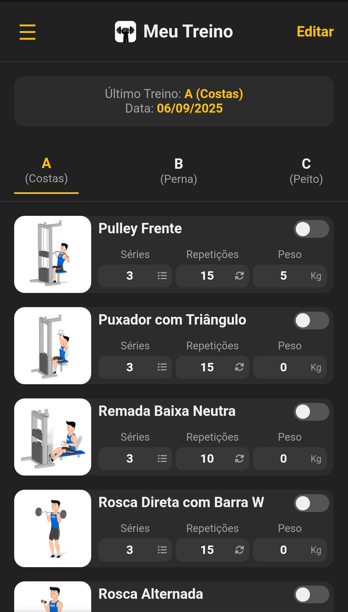
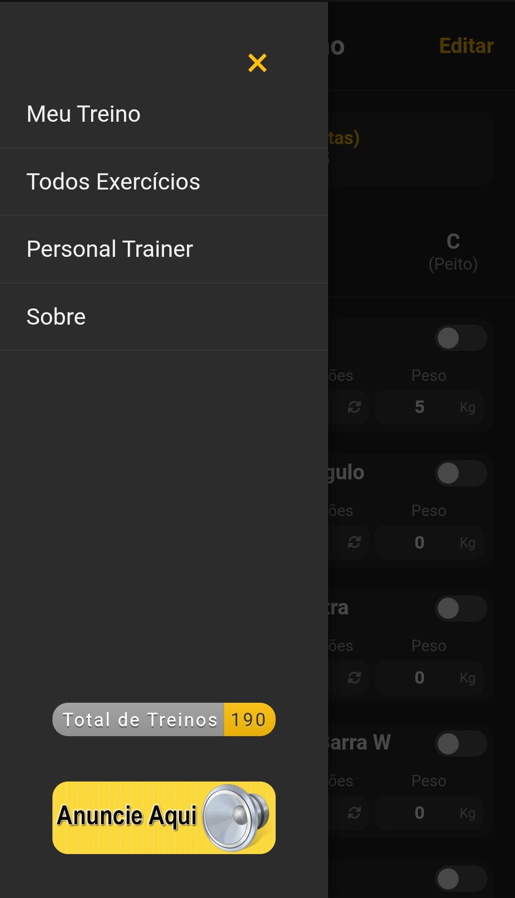

https://dex6354.github.io/MeuTreinoV7

E altere o valor predefinido "10" repetições dos exercícios, para "12" repetições

Aprimorado para telas pequenas

  
  
  

Atualizações

- Alterar abas de treinos
- Funciona 100% offline

Agora, quando um novo dispositivo acessar o site, deixe predefinido os exericios em cada aba:

A (Costas)
625

B (Perna)
276

C (Peito)
371

